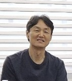

### CBR (Case-Based Reasoning 사례기반추론)
- 사람이 문제를 해결하기 위하여 추론하는 프로세스를 모델링한 AI/머신러닝 기술로
- 노하우(암묵지)를 구조화된 사례(형식지)로 시스템에 저장하고
- 문제 발생시 유사도 측정을 통해 문제 상황과 가장 유사한 사례(해결책)를 제시
#### 장점
- XAI → 제시된 유사 사례를 기반으로 설명 가능한 해결책 생성
- 사례를 추가함으로써 쉽게 추론 성능 향상
- CBR + MCP + 생성형AI → 환각현상을 최소화하고 정보 유출 없는 AI 서비스 제공
#### 적용 분야
- 조직 노하우 내재화 → 의료/헬스케어, MRO(유지보수정비) 등 전문가 노하우
- 개인 맞춤형 추천 →  사용자 취향에 최적인 상품, 정보 추천
#### CBR 솔루션
- CBR 모델링, 사례베이스 구축, 시스템 개발
- CBR 서버 → 유사도추론, 사례추가/제거 기능을 웹API로 제공
#### [AI/CBR 소개자료](/ai-intro-v5.5.pdf)
  
---

### 김해성 Profile
#### 미래안보산업전략연구원 AI 총괄 연구위원
- 방위산업, 식량안보 혁신을 위한 AI/CBR 솔루션 제공
#### 넥스트온 부사장
- 식물공장 환경모니터링 및 원격기기제어 시스템 개발 (MQTT / AWS IoT)
- 식물공장 딸기 생육측정 및 재배노하우 공유 시스템 설계 (CBR)
#### 헬스맥스 AI Architect
- AI기반 맞춤형 비만관리큐레이션 시스템 개발 (중소기업기술정보진흥원 / 헬스맥스, 청담바롬의원, 비에스라인)
- PHR기반 맞춤형 통합건강관리시스템 개발 (산업통상자원부 / 헬스맥스, 아주대, 닥터키친, 길병원)
#### 노하우플러스 대표
- 고령자 맞춤형 건강관리플랫폼 개발 (보건복지부 / 길병원, 헬스맥스)
- Wellness Mentor Support System 개발 (중소기업청 / 한국생산기술연구원, 헬스맥스)
- 발전플랜트 건설 노하우 재사용 시스템 컨설팅 (현대중공업 플랜트사업본부)
#### IBM Lotus Consulting Korea 지사장
- 도미노/노츠 기반 지식관리 컨설팅 총괄 (GS칼텍스, 포스코, KT)
#### 현대정보기술
- 인터넷사업본부 마케팅팀장, 인터넷전화 사업팀장
#### 현대전자 S/W 연구소
- 객체지향 S/W 플랫폼 개발팀장 / ISO9001 인증팀장 겸임
#### Apple Inc. USA
- Macintosh System Software 개발
#### Oregon State University, USA
- 전산학 석사, 소프트웨어공학 전공
#### 연세대학교
- 화공생명공학과 학사

---
Haesung Kim is an accomplished AI and software professional with a strong background in both technology and international business.

He began his career as a software developer, contributing to Macintosh System Software at Apple in California. He holds a Master's in Computer Science from Oregon State University and a Bachelor's in Chemical Engineering from Yonsei University in Seoul Korea.

His international experience includes serving as Country Manager for Lotus(IBM) Professional Service, where he consulted on knowledge management for major clients like GS Caltex, POSCO, and KT. He also managed US and Japan business operations as a Director at Solborn Inc. and worked on massive solar power plant projects as an agent for Japan's ORIX Corporation.

As an AI expert, he has developed his own Case-Based Reasoning (CBR) server and is highly skilled in creating AI models. He has led the development of various AI services for sharing and reusing knowledge in fields such as healthcare, medical, vertical farming, and army operations. His expertise lies in using AI to solve complex real-world problems.

---
[문의 이메일 hskim352@gmail.com](mailto:hskim352@gmail.com)
